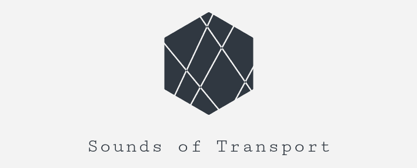

<p align="center">
  
</p>

# Sounds of Transport

Sounds of Transport is a fun and interactive web app where a musical loop can be created using shapes and the intricate train system of Tokyo.

The railway system in Tokyo; albeit being comprehensive and exquisite, can be overwhelming sometimes and may look like a complex mess on first sight. But there is a harmony to that, and this web app aims to show the harmony by creating music through the interactions of trains and "receivers".

## How to use

Interacting with the app is done through creating and placing receivers on the map, receivers are shapes that can be drawn on to the map using the drawing bar on the top left corner of the application. These receivers have different functions and expectations. Once a receiver's expectations are met, it simply activates its function.

There are 3 types of receivers with different functions:

- **Circular:** When a train intersects with it, it plays an audio, looping forever until a train no longer exists within its bounds.
- **Rectangular**: When a train intersects with it, it starts a cycle of being active/inactive. It continuously plays an audio during its active phase and pauses to rest during its inactive phase.
- **Polyline**: When a train passes over it, it plays the audio once. When another train passes over, it plays the audio again from the beginning.

These properties and the audio to play can be adjusted through the popup menu that is opened by clicking on the receiver.

Moreover, the speed of time ticks can be adjusted using the control buttons on the bottom right corner. (Although fun, this function may confuse the animation cycles, so it's only recommended for the fun, not the real masterpiece creation!)

Due to the high amount of train lines, the application can be a bit slow on older devices, if you seem to be having performance issues, the number of train lines being tracked can be filtered through the settings menu button on the top right corner. Although created with the thought, this web app is not optimized for mobile use. Thus using PC is recommended for a better user experience.

## Technical Details

The application is a simple Javascript web application that solely runs on the client's browser. It uses leaflet.js for the map display and jquery for the map interactions along with some low-level leaflet.js plugins. For more technical information about the implementation, source code can be seen from [github.com/umutto/sounds-of-transport](https://www.github.com/umutto/sounds-of-transport).

This application uses 3 data sources from the odpt data dump, namely; `odpt:Railway`, `odpt:Station` and `odpt:TrainTimetable`. Bus and Airline data are omitted due to performance and UX issues. This data is pre-parsed using python to minimize the size of the initial file downloaded.

Currently, the application only uses the data dumps, switching to the live data is a work in progress. The application is still in development and will be frequently updated.

## Footnote

This is my entry for the [3rd Open Data Challenge for Public Transportation in Tokyo](https://tokyochallenge.odpt.org/en/index.html) competition.

Due to the limited time I had on the challenge, I've decided to make something light-hearted and fun, it needs a lot of optimization and I want to add a lot more features so it should be updated frequently (hopefully).

I will try to make a more serious entry next year so be sure to check my [GitHub](https://github.com/umutto) if you're interested!

```
The source of the public transportation data in this app, etc. is the Open Data Challenge for Public Transportation in Tokyo.
They are based on the data provided by the public transportation operators. The accuracy and integrity of the data are not guaranteed. Please do not contact the public transportation operators directly regarding the content of the app.
For inquiries on the app, please contact the following email address.
umutkarakulak@hotmail.com

```
